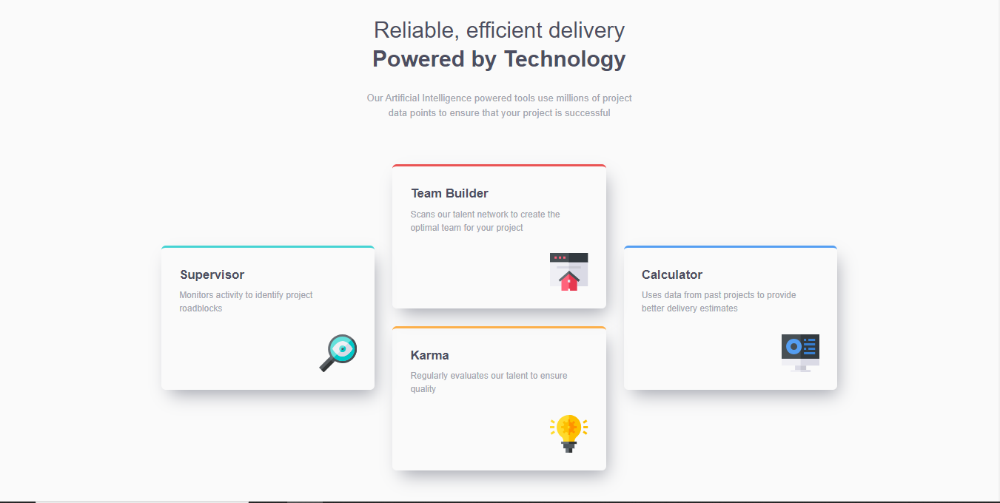
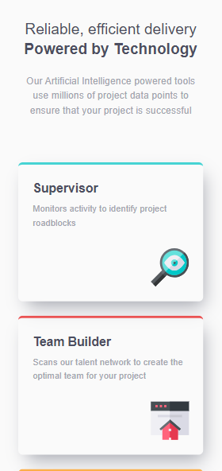
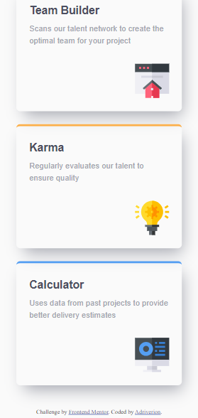

# Frontend Mentor - Four card feature section solution

This is a solution to the [Four card feature section challenge on Frontend Mentor](https://www.frontendmentor.io/challenges/four-card-feature-section-weK1eFYK). Frontend Mentor challenges help you improve your coding skills by building realistic projects. 

## Table of contents

- [Overview](#overview)
  - [The challenge](#the-challenge)
  - [Screenshot](#screenshot)
  - [Links](#links)
- [My process](#my-process)
  - [Built with](#built-with)
  - [What I learned](#what-i-learned)
  - [Useful resources](#useful-resources)
- [Author](#author)

## Overview

### The challenge

Users should be able to:

- View the optimal layout for the site depending on their device's screen size

### Screenshot

### Links

- Live Site URL: [vercel.com](https://four-card-feature-section-mu-ten.vercel.app/)

## My process

### Built with

- Semantic HTML5 markup
- CSS custom properties
- Flexbox
- CSS Grid
- Mobile-first workflow
- responsive design 

### What I learned

I have learned a more complete use of custom properties and the clamp() function, I have also adopted a mobile first way of working as a practice, besides how much the exercise made it easier for me, finally I have become familiar with the units of relative measures, I am still a beginner in this respect but I am happy with the final result.

### Useful resources

- [Normalize](https://necolas.github.io/normalize.css/) - resource used to normalize the styles of my page
- [web.dev learn](https://web.dev/learn/design/typography?continue=https%3A%2F%2Fweb.dev%2Flearn%2Fdesign&hl=es-419#article-https://web.dev/learn/design/typography&hl=es-419) - I learned about responsive typography 
- [Utopia.fyi](https://utopia.fyi/) - tool that helped me to create the measures for the clamp property

## Author

- Frontend Mentor - [@Adriverion](https://www.frontendmentor.io/profile/Adriverion)
- Twitter - [@\_Adriverion\_](https://x.com/_Adriverion_)
